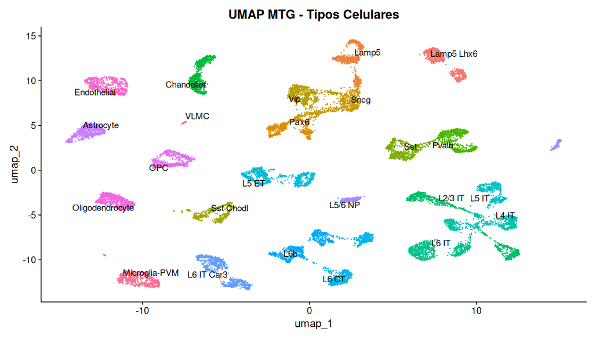
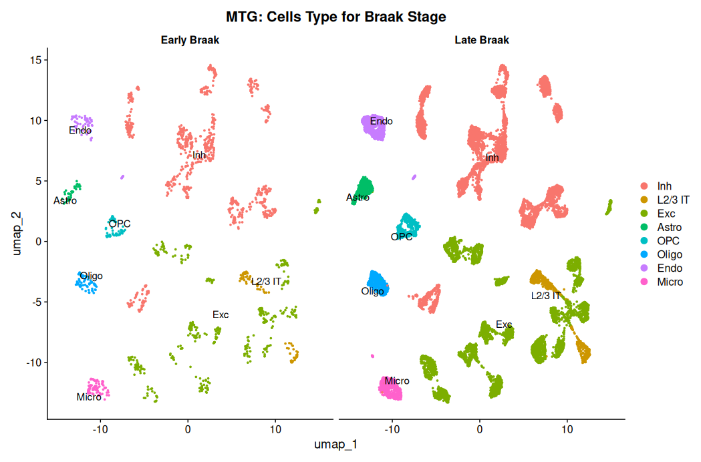

# Introduction

Alzheimer’s disease (AD) is a progressive neurodegenerative disorder and one of the leading causes of dementia worldwide, characterized by pathological features such as β-amyloid plaques, tau neurofibrillary tangles, neuroinflammation, and synaptic dysfunction.

Understanding how different brain cell types are affected during disease progression remains a major challenge. Recent advances in single-cell RNA sequencing (scRNA-seq) enable the exploration of cellular heterogeneity at high resolution, allowing the identification of cell-type-specific alterations associated with AD.

In this project, we analyze large-scale scRNA-seq datasets from the Seattle Alzheimer’s Disease Atlas (SEAAD), focusing on two key brain regions: the Middle Temporal Gyrus (MTG) and the Dorsolateral Prefrontal Cortex (DLPFC).

The workflow involves processing and organizing high-dimensional data to generate curated subsets for downstream analyses. These include disease-stage comparisons and detailed cell-type characterization, providing a structured foundation for exploring molecular and cellular patterns associated with Alzheimer’s disease.

------------------------------------------------------------------------

# Data Sources

## Datasets

| Dataset | Região cerebral | Arquivo |
|--------------------|--------------------------------|--------------------|
| SEAAD MTG | Giro Temporal Médio | [Download (.h5ad)](https://sea-ad-single-cell-profiling.s3.amazonaws.com/MTG/RNAseq/SEAAD_MTG_RNAseq_all-nuclei.2024-02-13.h5ad) |
| SEAAD DLPFC | Córtex Pré-frontal Dorsolateral | [Download (.h5ad)](https://sea-ad-single-cell-profiling.s3.amazonaws.com/PFC/RNAseq/SEAAD_A9_RNAseq_final-nuclei.2024-02-13.h5ad) |

## Metadata

| Metadata | Região | Arquivo |
|---------------------------|----------------------|------------------------|
| MTG metadata | Giro Temporal Médio | [Download (.csv)](https://sea-ad-single-cell-profiling.s3.amazonaws.com/MTG/RNAseq/Supplementary%20Information/SEAAD_MTG_RNAseq_all-nuclei_metadata.2024-02-13.csv) |
| DLPFC metadata | Córtex Pré-frontal | [Download (.csv)](https://sea-ad-single-cell-profiling.s3.amazonaws.com/PFC/RNAseq/SEAAD_A9_RNAseq_all-nuclei_metadata.2024-02-13.csv) |

> All datasets are publicly available through the [Seattle Alzheimer's Disease Brain Cell Atlas (SEA-AD)](https://sea-ad.org/).

------------------------------------------------------------------------

# Workflow

## Overview

The analysis was performed using the [nf_scrank](https://github.com/diegomscoelho/nf_scrank) pipeline, which integrates **scRank**, **GENIE3**, and **Seurat** into a reproducible Nextflow workflow executed on the NPAD/UFRN supercomputer via Singularity.

The pipeline was run with the following command:

``` bash
nextflow run main.nf \
  --obj /home/bpdrmorais/nf_scrank/SEAD_MTG_braakstage_symbol.rds \
  --column cell_braak \
  --species human \
  --n_cells 1000 \
  --n_cores 16 \
  --target input_bellenguez.txt \
  -profile singularity \
  --outdir results_seadcell2 \
  -resume
```

```{=html}
<svg width="100%" viewBox="0 0 680 740" xmlns="http://www.w3.org/2000/svg">
  <defs>
    <marker id="arrow" viewBox="0 0 10 10" refX="8" refY="5" markerWidth="6" markerHeight="6" orient="auto-start-reverse">
      <path d="M2 1L8 5L2 9" fill="none" stroke="context-stroke" stroke-width="1.5" stroke-linecap="round" stroke-linejoin="round"/>
    </marker>
  </defs>

  <rect x="40" y="30" width="170" height="56" rx="8" stroke-width="0.5" fill="#E6F1FB" stroke="#185FA5"/>
  <text font-size="14" font-weight="500" x="125" y="52" text-anchor="middle" dominant-baseline="central" fill="#0C447C">SEAAD MTG</text>
  <text font-size="12" x="125" y="70" text-anchor="middle" dominant-baseline="central" fill="#185FA5">Giro temporal médio</text>

  <rect x="470" y="30" width="170" height="56" rx="8" stroke-width="0.5" fill="#E6F1FB" stroke="#185FA5"/>
  <text font-size="14" font-weight="500" x="555" y="52" text-anchor="middle" dominant-baseline="central" fill="#0C447C">SEAAD DLPFC</text>
  <text font-size="12" x="555" y="70" text-anchor="middle" dominant-baseline="central" fill="#185FA5">Córtex pré-frontal</text>

  <line x1="210" y1="58" x2="278" y2="128" stroke="#888780" stroke-width="1.5" marker-end="url(#arrow)"/>
  <line x1="470" y1="58" x2="402" y2="128" stroke="#888780" stroke-width="1.5" marker-end="url(#arrow)"/>

  <rect x="215" y="128" width="250" height="70" rx="8" stroke-width="0.5" fill="#E1F5EE" stroke="#0F6E56"/>
  <text font-size="14" font-weight="500" x="340" y="150" text-anchor="middle" dominant-baseline="central" fill="#085041">R — Python — Scanpy</text>
  <text font-size="12" x="340" y="168" text-anchor="middle" dominant-baseline="central" fill="#0F6E56">Filtro Braak · seleção de células</text>
  <text font-size="12" x="340" y="184" text-anchor="middle" dominant-baseline="central" fill="#0F6E56">Early vs Late · export .rds</text>

  <line x1="340" y1="198" x2="340" y2="248" stroke="#888780" stroke-width="1.5" marker-end="url(#arrow)"/>

  <rect x="60" y="248" width="560" height="230" rx="12" fill="none" stroke-dasharray="6 4" stroke-width="1" stroke="#888780"/>
  <text font-size="12" x="80" y="268" dominant-baseline="central" fill="#5F5E5A">nf_scrank pipeline</text>

  <rect x="90" y="278" width="190" height="44" rx="8" stroke-width="0.5" fill="#F1EFE8" stroke="#5F5E5A"/>
  <text font-size="14" font-weight="500" x="185" y="300" text-anchor="middle" dominant-baseline="central" fill="#2C2C2A">Input .rds + targets</text>

  <rect x="400" y="278" width="190" height="44" rx="8" stroke-width="0.5" fill="#F1EFE8" stroke="#5F5E5A"/>
  <text font-size="14" font-weight="500" x="495" y="293" text-anchor="middle" dominant-baseline="central" fill="#2C2C2A">input_bellenguez.txt</text>
  <text font-size="12" x="495" y="311" text-anchor="middle" dominant-baseline="central" fill="#5F5E5A">35 genes-alvo AD</text>

  <line x1="280" y1="300" x2="318" y2="340" stroke="#888780" stroke-width="1.5" marker-end="url(#arrow)"/>
  <line x1="400" y1="300" x2="362" y2="340" stroke="#888780" stroke-width="1.5" marker-end="url(#arrow)"/>

  <rect x="215" y="340" width="130" height="44" rx="8" stroke-width="0.5" fill="#EEEDFE" stroke="#534AB7"/>
  <text font-size="14" font-weight="500" x="280" y="362" text-anchor="middle" dominant-baseline="central" fill="#3C3489">Seurat</text>

  <rect x="365" y="340" width="130" height="44" rx="8" stroke-width="0.5" fill="#EEEDFE" stroke="#534AB7"/>
  <text font-size="14" font-weight="500" x="430" y="362" text-anchor="middle" dominant-baseline="central" fill="#3C3489">GENIE3</text>

  <line x1="310" y1="384" x2="330" y2="416" stroke="#888780" stroke-width="1.5" marker-end="url(#arrow)"/>
  <line x1="430" y1="384" x2="350" y2="416" stroke="#888780" stroke-width="1.5" marker-end="url(#arrow)"/>

  <rect x="215" y="416" width="250" height="44" rx="8" stroke-width="0.5" fill="#FAECE7" stroke="#993C1D"/>
  <text font-size="14" font-weight="500" x="340" y="432" text-anchor="middle" dominant-baseline="central" fill="#712B13">scRank</text>
  <text font-size="12" x="340" y="450" text-anchor="middle" dominant-baseline="central" fill="#993C1D">perb_score por célula e alvo</text>

  <line x1="280" y1="478" x2="225" y2="518" stroke="#888780" stroke-width="1.5" marker-end="url(#arrow)"/>
  <line x1="340" y1="478" x2="340" y2="518" stroke="#888780" stroke-width="1.5" marker-end="url(#arrow)"/>
  <line x1="400" y1="478" x2="455" y2="518" stroke="#888780" stroke-width="1.5" marker-end="url(#arrow)"/>

  <rect x="50" y="518" width="175" height="56" rx="8" stroke-width="0.5" fill="#FAEEDA" stroke="#854F0B"/>
  <text font-size="14" font-weight="500" x="137" y="540" text-anchor="middle" dominant-baseline="central" fill="#633806">Heatmap</text>
  <text font-size="12" x="137" y="558" text-anchor="middle" dominant-baseline="central" fill="#854F0B">Late − Early por gene</text>

  <rect x="252" y="518" width="175" height="56" rx="8" stroke-width="0.5" fill="#FAEEDA" stroke="#854F0B"/>
  <text font-size="14" font-weight="500" x="339" y="540" text-anchor="middle" dominant-baseline="central" fill="#633806">UMAP</text>
  <text font-size="12" x="339" y="558" text-anchor="middle" dominant-baseline="central" fill="#854F0B">Distribuição celular</text>

  <rect x="454" y="518" width="175" height="56" rx="8" stroke-width="0.5" fill="#FAEEDA" stroke="#854F0B"/>
  <text font-size="14" font-weight="500" x="541" y="534" text-anchor="middle" dominant-baseline="central" fill="#633806">Alvos terapêuticos</text>
  <text font-size="12" x="541" y="552" text-anchor="middle" dominant-baseline="central" fill="#854F0B">35 genes priorizados</text>

  <text font-size="12" x="340" y="608" text-anchor="middle" fill="#5F5E5A">ACE · BIN1 · CLU · EGFR · GRN · INPP5D · SORT1 · TREML2 ···</text>
  <text font-size="12" x="340" y="630" text-anchor="middle" fill="#5F5E5A">Executado via Nextflow · Singularity · NPAD/UFRN</text>
  <text font-size="12" x="340" y="648" text-anchor="middle" fill="#5F5E5A">--n_cells 1000 · --n_cores 16 · --species human</text>
</svg>
```
The pipeline consists of the following steps:

1. Filtering patients with **Dementia diagnosis**
2. Classifying samples based on **Braak stages** (Early: I–III; Late: IV–VI)
3. Selecting cells (**200–1,000 per cell type**) to balance cellular composition
4. Processing large-scale datasets using **Scanpy** (Python)
5. Exporting curated subsets for downstream analysis in **Seurat** (R)
6. Creating a metadata column (`cell_braak`) for **scRank-based** analysis
7. Running the **nf_scrank** pipeline for perturbation scoring across cell types and targets
8. Prioritizing therapeutic targets based on `perb_score` differences between Early and Late Braak stages

------------------------------------------------------------------------

# Results

## Cell-Type Distribution

After rigorous quality control and data conversion, we performed dimensionality reduction to visualize the distribution of cells in the MTG region. The UMAP projection reveals clear clustering of major brain cell types, highlighting the cellular heterogeneity of the dataset.

{#fig-umap-geral fig-align="center"}

## Disease Staging (Braak Pathology)

To investigate cellular dynamics during Alzheimer's disease progression, neuronal subtypes were simplified into major classes (Excitatory and Inhibitory) and segregated according to Braak pathology. The split UMAP demonstrates the spatial comparison of cell populations between Early and Late Braak stages.

{#fig-umap-braak}
